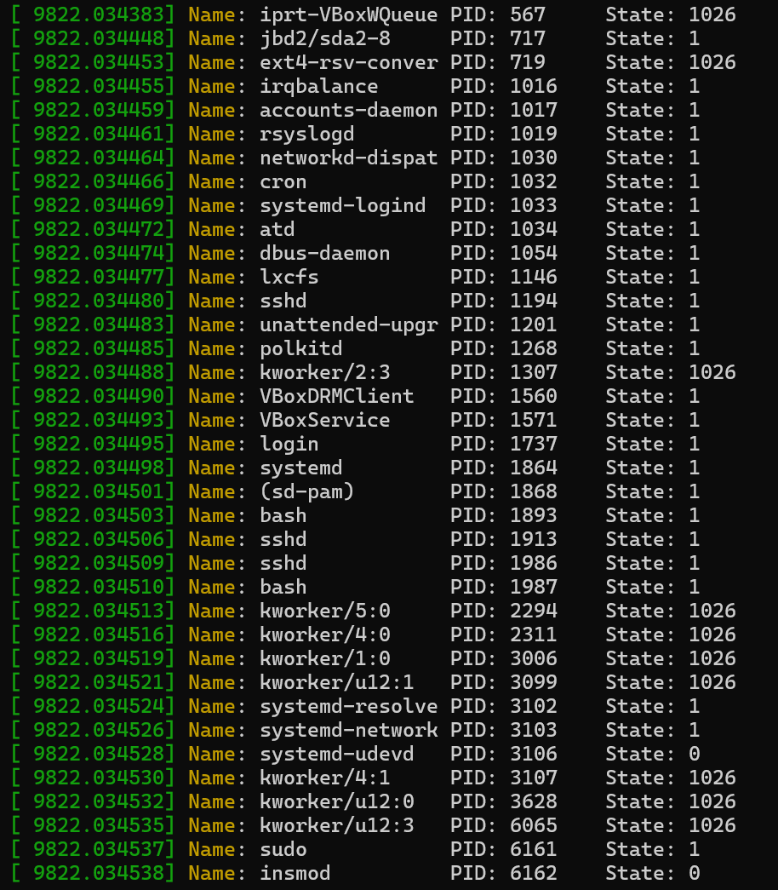

1. 
  a. 
    Processor: A processor (or CPU) is the brain of the computer. It is a hardware that performs data input/output, processing and storage functions for a computer system. 
    Core: A core is a single processing unit within the CPU. It is the basic computation unit of the CPU. 
  b. 6 - lscpu 
  c. 6 - /proc/cpuinfo 
  d. 2995.200 MHz - /rpoc/cpuinfo 
  e. x86_64 - lscpu 
  f. 4040224 kB - /proc/meminfo 
  g. 3657908 kB - /proc/meminfo 
  h. forks - 2008 - /proc/stat 
     context switches - 320822 - /proc/stat 

2. 
    a. 2019 
    b. 100% CPU, 0% memory 
    c. Running 

3. 
&nbsp;&nbsp;&nbsp;&nbsp;&nbsp;&nbsp;&nbsp;&nbsp;&nbsp;&nbsp;Virtual Memory&nbsp;&nbsp;Physical Memory 
 &nbsp;&nbsp;&nbsp;memory1.c&nbsp;&nbsp;8304 kB&nbsp;&nbsp;&nbsp;796 kB 
 &nbsp;&nbsp;&nbsp;memory2.c&nbsp;&nbsp;8300 kB&nbsp;&nbsp;&nbsp;3272 kB

 
Both memory1.c and memory2.c initialise an integer array of the same size. So, for both, the same amount of virtual memory is allocated.
But, memory1.c does not access the array that was declared, while memory2.c does. So, since memory1.c does not access its integer array, no additional physical memory is allocated. On the other hand, memory2.c accesses the first half of its integer array, so additional physical memory is allocated.

6. 

